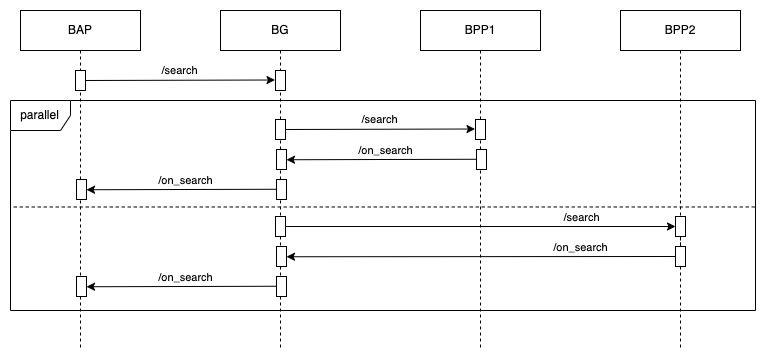
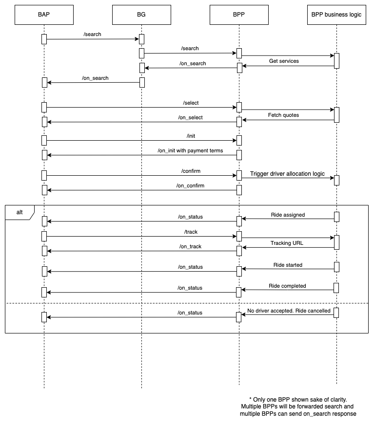
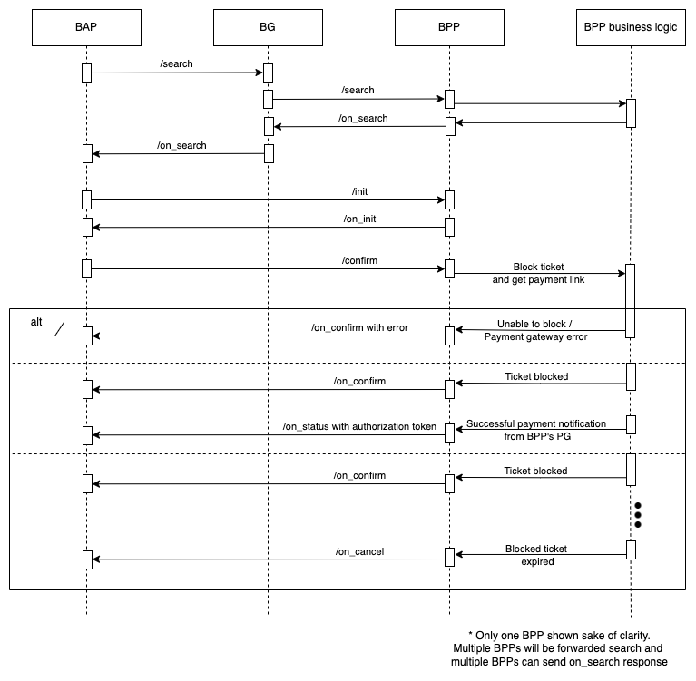
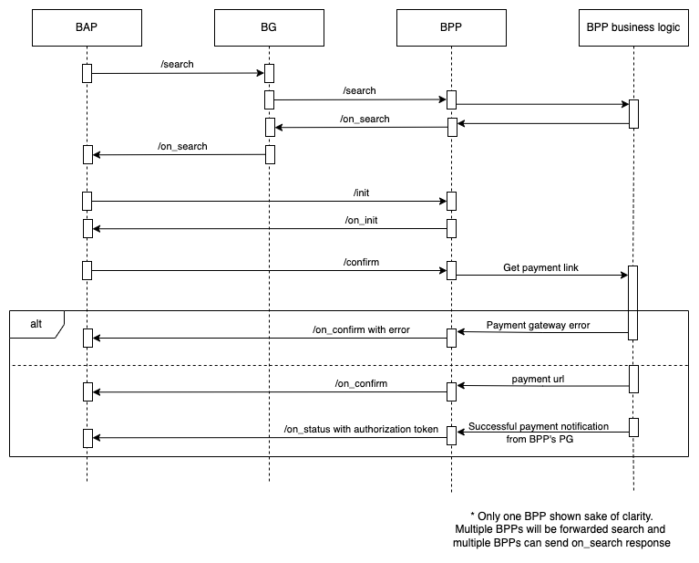
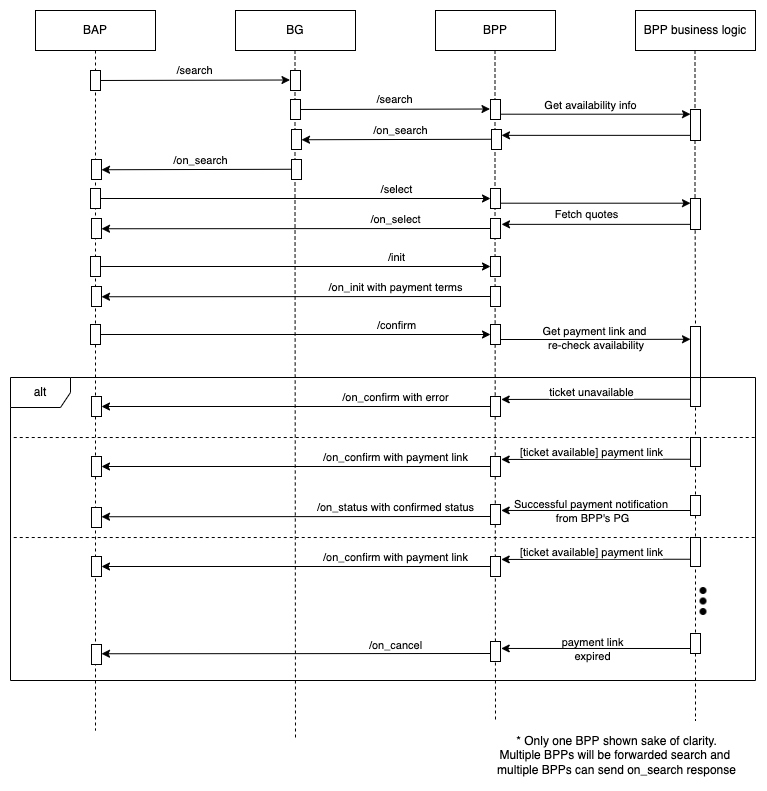

# Discovery flow

Discovery sequence diagram is as shown below. Discovery in all domains will follow the same sequence diagram as below.

# On Demand Cabs

The below sequence diagram represents an order flow for on demand cabs. Here the fare will be dynamic based on the exact pickup and drop location of the customer as well as time of the journey.

In the above example payment happens offline and post fulfillment. Hence the driver allocation logic was triggered as soon as the confirm call was received. 

# Public Transit

In the case of most public transit systems, the routes will be fixed.

There can be public transit systems where capacity is critical and you will be buying a ticket for a specific time and vehicle. An example for that can be seen below where the ticket is blocked for a certain period during which the user can complete the payment. Post the time period, if the payment is still not completed the blocked ticket will be unblocked. In the below example the BPP is collecting payment using a payment link. Water taxis are an example of this type of public transit.

There can be public transit systems where the general public can book tickets just by specifying a start and end station and the ticket will be valid for any of the trips between the station. There can also be transit passes which will also not be for a specific time or vehicle. The diagram below represents such a transit system where tickets need not be blocked.  In the below example the BPP is collecting payment using a payment link. Metros are an example of this type of public transit. 

# Parking

Customers can search for parking spots near a location, know their capacity and availability information, and book a parking spot. In the below example the BPP collects payment using a payment link.  

