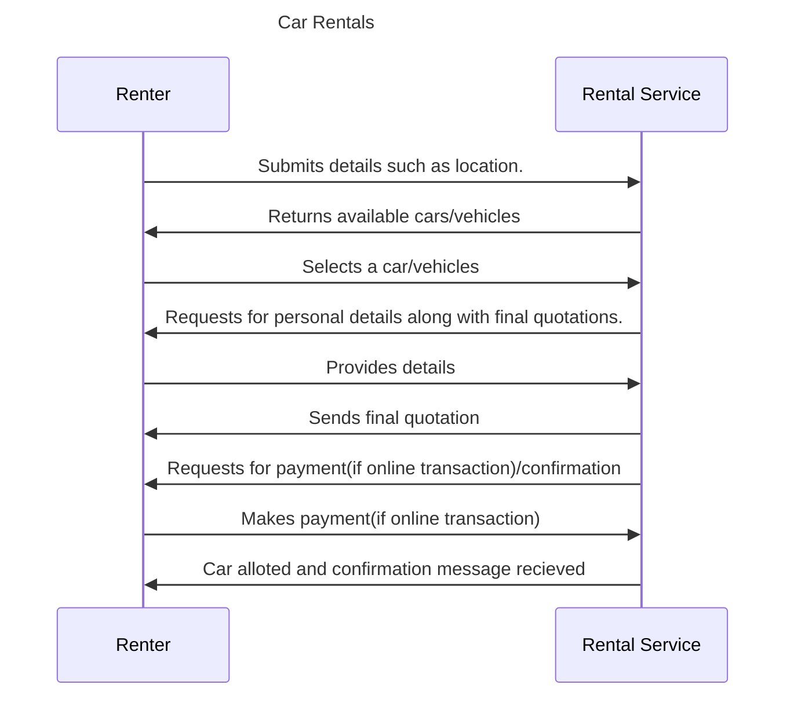

## Car Rental Use Cases

### Introduction

Discover unmatched convenience and comfort with our premium car rental services. Choose from a diverse fleet of meticulously maintained vehicles, ensuring a safe and stylish journey. With competitive pricing, flexible options, and a commitment to customer satisfaction, we're here to make your travel experience exceptional. Book your dream car now and elevate your journey.

### Use Cases considered

- Car Rentals


### Workflow

**Step 1: Search for various car rental services**

- The renter searches for car rental services available in the desired location or region.

**Step 2: Choose a Suitable Car**

- The renter selects the type of car they need, considering factors like size, model, features, and rental rates,.

**Step 3: Check Rental Terms and Conditions**

- The renter reviews the rental terms, including mileage limits, fuel policy, return conditions, and any extra fees.

**Step 4: Submit required information**

- Renter provides personal information,chooses the rental start and end dates and times based on their travel plans,selects optional add-ons like GPS navigation, child seats, insurance coverage, etc.

**Step 5: Get Rental Car Quotation**

- The system calculates the total cost of the rental, including the base rate, taxes, fees, and selected add-ons adn payment link(if mode is selected as online payment).

**Step 6: Renter Pays the amount(if online transaction)**

- The renter provides identification documents, a valid driver's license, and payment for the remaining rental amount.

**Step 7: Receive the Confirmation message**

- Renter recieves the final confirmation message and details of the car laong with the details he selected.




### Example Jsons

#### An example `search` request 

``` 
{
    "context": {
      "country": "IND",
      "domain": "nic2004:60221",
      "timestamp": "2023-03-23T04:41:16Z",
      "bap_id": "example-bap.com",
      "transaction_id": "6743e9e2-4fb5-487c-92b7-13ba8018f176",
      "message_id": "6743e9e2-4fb5-487c-92b7-13ba8018f176",
      "city": "std:080",
      "core_version": "1.1.0",
      "action": "search",
      "bap_uri": "https://mock_bap.com/beckn/"
    },
    "message": {
      "intent": {
        "fulfillment": {
          "stops": [
            {
              "location": {
                "descriptor": {
                  "name": "pickup"
                },
                "gps": "12.923608703179461, 77.61462964117527"
              }
            },
            {
              "location": {
                "descriptor": {
                  "name": "dropoff"
                },
                "gps": "12.9346302, 77.61533969999999"
              }
            }
          ],
          "customer": {
            "person": {
              "tags": [
                {
                  "descriptor": {
                    "name": "Localization"
                  },
                  "list": [
                    {
                      "descriptor": {
                        "name": "Language"
                      },
                      "value": "en"
                    }
                  ],
                  "display": false
                }
              ]
            }
          }
        }
      }
    }
  }
  
```

#### An example `on_search` callback

```
{
    "context": {
      "domain": "nic2008:49213",
      "country": "IND",
      "city": "std:011",
      "action": "on_search",
      "core_version": "1.1.0",
      "bap_id": "example-bap.com",
      "bap_uri": "https://mock_bap.com/beckn/",
      "bpp_id": "example-bpp.com",
      "bpp_uri": "https://api.car-rental-provider.com/beckn/",
      "transaction_id": "6f339232-2bc3-44d2-915c-30d2b053ce1d",
      "message_id": "fde8b8b6-c2e5-49f7-b254-720843d528bd",
      "timestamp": "2021-03-23T10:00:40.065Z"
    },
    "message": {
      "catalog": {
        "descriptor": {
          "name": "Car Rental Provider",
          "images": [
            {
              "url": "https://car-rental-provider.com/logos/logo.ico"
            }
          ]
        },
        "providers": [
          {
            "id": "1",
            "descriptor": {
              "name": "ABC Car Rentals",
              "images": [
                {
                  "url": "https://abccarrentals.com/logos/logo.ico"
                }
              ]
            },
            "items": [
              {
                "id": "1",
                "descriptor": {
                  "name": "Economy Car",
                  "images": [
                    {
                      "url": "https://abccarrentals.com/icons/economy.ico"
                    }
                  ]
                },
                "fulfillment_ids": ["1"],
                "price": {
                  "currency": "INR",
                  "value": "2000"
                }
              },
              {
                "id": "2",
                "descriptor": {
                  "name": "Standard Car",
                  "images": [
                    {
                      "url": "https://abccarrentals.com/icons/standard.ico"
                    }
                  ]
                },
                "fulfillment_ids": ["2"],
                "price": {
                  "currency": "INR",
                  "value": "3000"
                }
              },
              {
                "id": "3",
                "descriptor": {
                  "name": "Luxury Car",
                  "images": [
                    {
                      "url": "https://abccarrentals.com/icons/luxury.ico"
                    }
                  ]
                },
                "fulfillment_ids": ["3"],
                "price": {
                  "currency": "INR",
                  "value": "5000"
                }
              }
            ],
            "fulfillments": [
              {
                "id": "1",
                "stops": [
                  {
                    "location": {
                      "descriptor": {
                        "name": "ABC Car Rentals Office"
                      },
                      "gps": "28.5678901,77.1234567"
                    }
                  }
                ],
                "tags": [
                  {
                    "list": [
                      {
                        "descriptor": {
                          "name": "Duration"
                        },
                        "value": "24 hours"
                      },
                      {
                        "descriptor": {
                          "name": "Fuel Policy"
                        },
                        "value": "Full to full"
                      }
                    ]
                  }
                ]
              },
              {
                "id": "2",
                "stops": [
                  {
                    "location": {
                      "descriptor": {
                        "name": "ABC Car Rentals Office"
                      },
                      "gps": "28.5678901,77.1234567"
                    }
                  }
                ],
                "tags": [
                  {
                    "list": [
                      {
                        "descriptor": {
                          "name": "Duration"
                        },
                        "value": "48 hours"
                      },
                      {
                        "descriptor": {
                          "name": "Fuel Policy"
                        },
                        "value": "Full to full"
                      }
                    ]
                  }
                ]
              },
              {
                "id": "3",
                "stops": [
                  {
                    "location": {
                      "descriptor": {
                        "name": "ABC Car Rentals Office"
                      },
                      "gps": "28.5678901,77.1234567"
                    }
                  }
                ],
                "tags": [
                  {
                    "list": [
                      {
                        "descriptor": {
                          "name": "Duration"
                        },
                        "value": "72 hours"
                      },
                      {
                        "descriptor": {
                          "name": "Fuel Policy"
                        },
                        "value": "Full to full"
                      }
                    ]
                  }
                ]
              }
            ]
          }
        ]
      }
    }
  }
  
```

#### An example `select` request 

```
{
    "context": {
      "domain": "nic2004:60221",
      "country": "IND",
      "city": "std:080",
      "action": "select",
      "core_version": "1.1.0",
      "bap_id": "example-bap.com",
      "bap_uri": "https://mock_bap.com/beckn/",
      "bpp_id": "example-bpp.com",
      "bpp_uri": "https://api.car-rental-provider.com/beckn/",
      "transaction_id": "6f339232-2bc3-44d2-915c-30d2b053ce1d",
      "message_id": "fde8b8b6-c2e5-49f7-b254-720843d528bd",
      "timestamp": "2021-03-23T10:00:40.065Z"
    },
    "message": {
      "order": {
        "items": [
          {
            "id": "1"
          }
        ],
        "provider": {
          "id": "1"
        }
      }
    }
  }
  
```

#### An example `on_select` callback

```
{
    "context": {
      "domain": "nic2008:49213",
      "country": "IND",
      "city": "std:011",
      "action": "on_select",
      "core_version": "1.1.0",
      "bap_id": "example-bap.com",
      "bap_uri": "https://mock_bap.com/beckn/",
      "bpp_id": "example-bpp.com",
      "bpp_uri": "https://api.car-rental-provider.com/beckn/",
      "transaction_id": "6f339232-2bc3-44d2-915c-30d2b053ce1d",
      "message_id": "fde8b8b6-c2e5-49f7-b254-720843d528bd",
      "timestamp": "2021-03-23T10:00:40.065Z"
    },
    "message": {
      "order": {
        "id": "123413",
        "items": [
          {
            "id": "1",
            "descriptor": {
              "name": "Economy Car"
            },
            "fulfillment_id": "1",
            "price": {
              "currency": "INR",
              "value": "2000"
            },
            "tags": [
              {
                "list": [
                  {
                    "descriptor": {
                      "name": "Vehicle Category"
                    },
                    "value": "Economy"
                  },
                  {
                    "descriptor": {
                      "name": "Fuel Type"
                    },
                    "value": "Petrol"
                  }
                ]
              }
            ]
          }
        ],
        "provider": {
          "id": "1",
          "descriptor": {
            "name": "ABC Car Rentals",
            "images": [
              {
                "url": "https://car-rental-provider.com/logos/logo.ico"
              }
            ]
          }
        },
        "fulfillment": {
          "id": "1",
          "stops": [
            {
              "location": {
                "descriptor": {
                  "name": "Pick-up Location"
                },
                "gps": "28.5811261, 77.0548206"
              }
            },
            {
              "location": {
                "descriptor": {
                  "name": "Drop-off Location"
                },
                "gps": "28.6230972, 77.2099917"
              }
            }
          ],
          "vehicle": {
            "category": "CAR"
          },
          "tags": [
            {
              "list": [
                {
                  "descriptor": {
                    "name": "Duration"
                  },
                  "value": "24 hours"
                },
                {
                  "descriptor": {
                    "name": "Fuel Included"
                  },
                  "value": "No"
                }
              ]
            }
          ]
        },
        "quote": {
            "value": "2000",
            "currency": "INR",
            "breakup": [
              {
                "title": "Base Fare",
                "price": {
                  "value": "2000",
                  "currency": "INR"
                }
              }
            ]
        }
      }
    }
  }
  
```

#### An example `init` request

```
{
    "context": {
      "country": "IND",
      "bpp_uri": "https://api.car-rental-provider.com/beckn/7f7896dd-787e-4a0b-8675-e9e6fe93bb8f",
      "domain": "nic2004:60221",
      "timestamp": "2023-03-23T04:48:53Z",
      "bap_id": "example-bap.com",
      "bpp_id": "example-bpp.com",
      "transaction_id": "b580c989-f84d-4abe-af28-2c818aafce3b",
      "message_id": "8926b747-0362-4fcc-b795-0994a6287700",
      "city": "std:080",
      "core_version": "1.1.0",
      "action": "init",
      "bap_uri": "https://mock_bap.com/beckn/"
    },
    "message": {
      "order": {
        "provider": {
          "id": "7f7896dd-787e-4a0b-8675-e9e6fe93bb8f"
        },
        "items": [
          {
            "id": "5777a0bf-9a08-49aa-a97d-1e5561a9622e",
            "fulfillment_ids": [
              "fulf_5cf064d5-4c0a-42d3-b73d-5f19a6f7468e"
            ],
            "payment_ids": [
              "7f7896dd-787e-4a0b-8675-e9e6fe93bb8f"
            ],
            "descriptor": {
              "name": "Car Rental",
              "images": [
                {
                  "url": "https://carrental.com/icons/car-rental.ico"
                }
              ]
            }
          }
        ],
        "quote": {
          "value": "76",
          "currency": "INR",
          "breakup": [
            {
              "title": "Base Fare",
              "price": {
                "value": "30",
                "currency": "INR"
              }
            },
            {
              "title": "Per km fare",
              "price": {
                "value": "56",
                "currency": "INR"
              }
            }
          ]
        },
        "fulfillment": {
          "id": "fulf_5cf064d5-4c0a-42d3-b73d-5f19a6f7468e",
          "stops": [
            {
              "location": {
                "descriptor": {
                  "name": "Pick-up Location"
                },
                "gps": "13.008935, 77.6444085",
                "address": {
                  "ward": "Uttarahalli Hobli, Ramanjaneyanagar",
                  "country": "India",
                  "building": "6th Main Rd",
                  "state": "Karnataka",
                  "city": "Bengaluru",
                  "locality": "Uttarahalli Hobli",
                  "door": "98A, Sarovarm 2nd cross",
                  "area_code": "560061",
                  "street": "Ramanjaneyanagar"
                }
              }
            },
            {
              "location": {
                "descriptor": {
                  "name": "Drop-off Location"
                },
                "gps": "12.9711869, 77.5868122",
                "address": {
                  "ward": "Basavanagudi, Chikkanna Garden, Rangadore Memorial Hospital",
                  "country": "India",
                  "building": "Rangadore Memorial Hospital",
                  "state": "Karnataka",
                  "city": "Bengaluru",
                  "locality": "Basavanagudi",
                  "street": "Chikkanna Garden"
                }
              }
            }
          ],
          "agent": {
            "name": "RAGHAVENDRA J",
            "rateable": true,
            "rating": "5"
          },
          "vehicle": {
            "category": "CAR"
          }
        },
        "payment": {
          "id": "7f7896dd-787e-4a0b-8675-e9e6fe93bb8f",
          "type": "ON-FULFILLMENT",
          "collected_by": "BPP"
        },
        "customer": {
          "person": {
            "name": "John Doe",
            "phone": "+91-9897867564",
            "tags": [
              {
                "descriptor": {
                  "name": "Localization"
                },
                "list": [
                  {
                    "descriptor": {
                      "name": "Language"
                    },
                    "value": "en"
                  }
                ],
                "display": false
              }
            ]
          }
        }
      }
    }
  }
  
```

#### An example `on_init` callback 

```
{
    "context": {
      "domain": "nic2008:49213",
      "country": "IND",
      "city": "std:011",
      "action": "on_init",
      "core_version": "1.1.0",
      "bap_id": "example-bap.com",
      "bap_uri": "https://mock_bap.com/beckn/",
      "bpp_id": "example-bpp.com",
      "bpp_uri": "https://api.car-rental-provider.com/beckn/",
      "transaction_id": "6f339232-2bc3-44d2-915c-30d2b053ce1d",
      "message_id": "fde8b8b6-c2e5-49f7-b254-720843d528bd",
      "timestamp": "2021-03-23T10:00:40.065Z"
    },
    "message": {
      "order": {
        "items": [
          {
            "id": "3",
            "descriptor": {
              "name": "Economy Car Rental",
              "images": [
                {
                  "url": "https://carrental.com/icons/economy-car.ico"
                }
              ]
            },
            "fulfillment_ids": [
              "3"
            ],
            "price": {
              "currency": "INR",
              "value": "2000"
            },
            "tags": [
              {
                "list": [
                  {
                    "descriptor": {
                      "name": "Duration"
                    },
                    "value": "24 hours"
                  }
                ]
              }
            ]
          }
        ],
        "provider": {
          "id": "1",
          "descriptor": {
            "name": "ABC Car Rentals",
            "images": [
              {
                "url": "https://carrental.com/logos/logo.ico"
              }
            ]
          }
        },
        "fulfillment": {
          "id": "3",
          "stops": [
            {
              "location": {
                "descriptor": {
                  "name": "Pick-up Location"
                },
                "gps": "12.923608703179461, 77.61462964117527"
              },
              "time": {
                "timestamp": "2021-10-15T10:00:00.000Z"
              },
              "instructions": "Show this booking confirmation at the car rental desk to pick up your rental car."
            },
            {
              "location": {
                "descriptor": {
                  "name": "Drop-off Location"
                },
                "gps": "12.9346302, 77.61533969999999"
              }
            }
          ],
          "vehicle": {
            "category": "CAR"
          },
          "tags": [
            {
              "list": [
                {
                  "descriptor": {
                    "name": "Duration"
                  },
                  "value": "24 hours"
                }
              ]
            }
          ],
          "documents": [
            {
              "label": "Rental Agreement",
              "url": "https://carrental.com/agreements/rental-agreement.html"
            }
          ],
          "billing": {
            "name": "John Doe",
            "email": "john.doe@example.com"
          },
          "quote": {
            "price": {
              "currency": "INR",
              "value": "2000"
            },
            "breakup": [
              {
                "title": "Economy Car Rental",
                "price": {
                  "currency": "INR",
                  "value": "2000"
                }
              }
            ]
          },
          "payment": {
            "type": "ON-ORDER",
            "uri": "https://carrental.com/payment?amt=2000&cur=INR&ref=123456789",
            "tl_method": "GET",
            "status": "NOT-PAID"
          }
        }
      }
    }
  }
  
```

#### An example `confirm` request 

```
{
    "context": {
      "country": "IND",
      "bpp_uri": "https://api.car-rental-provider.com/beckn/7f7896dd-787e-4a0b-8675-e9e6fe93bb8f",
      "domain": "nic2004:60221",
      "timestamp": "2023-03-23T04:48:53Z",
      "bap_id": "example-bap.com",
      "bpp_id": "example-bpp.com",
      "transaction_id": "b580c989-f84d-4abe-af28-2c818aafce3b",
      "message_id": "8926b747-0362-4fcc-b795-0994a6287700",
      "city": "std:080",
      "core_version": "1.1.0",
      "action": "confirm",
      "bap_uri": "https://mock_bap.com/beckn/"
    },
    "message": {
      "order": {
        "id": "7751bd26-3fdc-47ca-9b64-e998dc5abe68",
        "provider": {
          "id": "e8542642-0f4a-454c-9a9f-f46110c367a3",
          "descriptor": {
            "name": "Raghavendra J"
          }
        },
        "items": [
          {
            "id": "5777a0bf-9a08-49aa-a97d-1e5561a9622e",
            "descriptor": {
              "name": "Car Rental",
              "code": "RENTAL"
            },
            "tags": [
              {
                "descriptor": {
                  "name": "Daytime Charges"
                },
                "list": [
                  {
                    "descriptor": {
                      "name": "Min Fare"
                    },
                    "value": "₹ 2000"
                  },
                  {
                    "descriptor": {
                      "name": "Rate above Min. Fare"
                    },
                    "value": "₹ 15 / hr"
                  }
                ],
                "display": true
              },
              {
                "descriptor": {
                  "name": "Additional Charges"
                },
                "list": [
                  {
                    "descriptor": {
                      "name": "Driver Charges"
                    },
                    "value": "₹ 500"
                  }
                ],
                "display": true
              }
            ],
            "fulfillment_ids": [
              "fb5c84d4-1b59-4b9d-96b5-9d79107432c5"
            ],
            "payment_ids": [
              "1"
            ]
          }
        ],
        "quote": {
          "value": "3000",
          "currency": "INR",
          "breakup": [
            {
              "title": "Base Fare",
              "price": {
                "value": "2000",
                "currency": "INR"
              }
            },
            {
              "title": "Per hour fare",
              "price": {
                "value": "15",
                "currency": "INR"
              }
            },
            {
              "title": "Driver Charges",
              "price": {
                "value": "500",
                "currency": "INR"
              }
            },
            {
              "title": "CGST @ 5%",
              "price": {
                "value": "7.5",
                "currency": "INR"
              }
            },
            {
              "title": "SGST @ 5%",
              "price": {
                "value": "7.5",
                "currency": "INR"
              }
            }
          ]
        },
        "fulfillment": {
          "id": "fulf_5cf064d5-4c0a-42d3-b73d-5f19a6f7468e",
          "agent": {
            "name": "RAGHAVENDRA J",
            "rateable": true,
            "rating": "5"
          },
          "vehicle": {
            "category": "CAR"
          },
          "customer": {
            "person": {
              "name": "John Doe",
              "phone": "+91-9897867564",
              "tags": [
                {
                  "descriptor": {
                    "name": "Localization"
                  },
                  "list": [
                    {
                      "descriptor": {
                        "name": "Language"
                      },
                      "value": "en"
                    }
                  ],
                  "display": false
                }
              ]
            }
          }
        },
        "payment": {
          "id": "7f7896dd-787e-4a0b-8675-e9e6fe93bb8f",
          "type": "ON-FULFILLMENT",
          "params": {
            "amount": "3000",
            "currency": "INR",
            "transaction_status": "NOT-PAID"
          }
        }
      }
    }
  }
  
```

#### An example `on_confirm` callback 

```
{
    "context": {
      "country": "IND",
      "bpp_uri": "https://api.car-rental-provider.com/beckn/7f7896dd-787e-4a0b-8675-e9e6fe93bb8f",
      "domain": "nic2004:60221",
      "timestamp": "2023-03-23T04:48:53Z",
      "bap_id": "example-bap.com",
      "bpp_id": "example-bpp.com",
      "transaction_id": "b580c989-f84d-4abe-af28-2c818aafce3b",
      "message_id": "8926b747-0362-4fcc-b795-0994a6287700",
      "city": "std:080",
      "core_version": "1.1.0",
      "action": "on_confirm",
      "bap_uri": "https://mock_bap.com/beckn/"
    },
    "message": {
      "order": {
        "id": "7751bd26-3fdc-47ca-9b64-e998dc5abe68",
        "provider": {
          "id": "e8542642-0f4a-454c-9a9f-f46110c367a3",
          "descriptor": {
            "name": "Raghavendra J"
          }
        },
        "items": [
          {
            "id": "5777a0bf-9a08-49aa-a97d-1e5561a9622e",
            "descriptor": {
              "name": "Car Rental",
              "code": "RENTAL"
            },
            "tags": [
              {
                "descriptor": {
                  "name": "Daytime Charges"
                },
                "list": [
                  {
                    "descriptor": {
                      "name": "Min Fare"
                    },
                    "value": "₹ 2000"
                  },
                  {
                    "descriptor": {
                      "name": "Rate above Min. Fare"
                    },
                    "value": "₹ 15 / hr"
                  }
                ],
                "display": true
              },
              {
                "descriptor": {
                  "name": "Additional Charges"
                },
                "list": [
                  {
                    "descriptor": {
                      "name": "Driver Charges"
                    },
                    "value": "₹ 500"
                  }
                ],
                "display": true
              }
            ],
            "fulfillment_ids": [
              "fb5c84d4-1b59-4b9d-96b5-9d79107432c5"
            ],
            "payment_ids": [
              "1"
            ]
          }
        ],
        "quote": {
          "value": "3000",
          "currency": "INR",
          "breakup": [
            {
              "title": "Base Fare",
              "price": {
                "value": "2000",
                "currency": "INR"
              }
            },
            {
              "title": "Per hour fare",
              "price": {
                "value": "15",
                "currency": "INR"
              }
            },
            {
              "title": "Driver Charges",
              "price": {
                "value": "500",
                "currency": "INR"
              }
            },
            {
              "title": "CGST @ 5%",
              "price": {
                "value": "7.5",
                "currency": "INR"
              }
            },
            {
              "title": "SGST @ 5%",
              "price": {
                "value": "7.5",
                "currency": "INR"
              }
            }
          ]
        },
        "fulfillment": {
          "id": "fulf_5cf064d5-4c0a-42d3-b73d-5f19a6f7468e",
          "state": {
            "descriptor": {
              "code": "DRIVER_EN_ROUTE",
              "name": "Driver is on the way"
            }
          },
          "stops": [
            {
              "authorization": {
                "type": "OTP",
                "token": "234234"
              },
              "location": {
                "gps": "13.008935, 77.6444085",
                "address": {
                  "ward": "Uttarahalli Hobli, Ramanjaneyanagar",
                  "country": "India",
                  "building": "6th Main Rd",
                  "state": "Karnataka 560061",
                  "city": "Bengaluru",
                  "locality": "Uttarahalli Hobli",
                  "door": "98A, Sarovarm 2nd cross",
                  "area_code": "560061",
                  "street": "Ramanjaneyanagar"
                }
              }
            },
            {
              "location": {
                "gps": "12.9711869, 77.5868122",
                "address": {
                  "ward": "Basavanagudi, Chikkanna Garden, Rangadore Memorial Hospital",
                  "country": "India",
                  "building": "Rangadore Memorial Hospital",
                  "state": "Karnataka",
                  "city": "Bengaluru",
                  "locality": "Basavanagudi",
                  "door": null,
                  "area_code": "",
                  "street": "Chikkanna Garden"
                }
              }
            }
          ],
          "agent": {
            "name": "RAGHAVENDRA J",
            "phone": "+91-98978675645",
            "rateable": true,
            "rating": "5"
          },
          "vehicle": {
            "category": "CAR",
            "registration": "KA01JG1231"
          },
          "customer": {
            "person": {
              "name": "John Doe",
              "phone": "+91-9897867564",
              "tags": [
                {
                  "descriptor": {
                    "name": "Localization"
                  },
                  "list": [
                    {
                      "descriptor": {
                        "name": "Language"
                      },
                      "value": "en"
                    }
                  ],
                  "display": false
                }
              ]
            }
          }
        },
        "payment": {
          "id": "7f7896dd-787e-4a0b-8675-e9e6fe93bb8f",
          "type": "ON-FULFILLMENT",
          "params": {
            "amount": "3000",
            "currency": "INR",
            "transaction_status": "NOT-PAID"
          }
        }
      }
    }
  }
  
```

#### POST FULFILLMENT(`status`)

```
{
    "context": {
      "country": "IND",
      "bpp_uri": "https://api.car-rental-provider.com/beckn/7f7896dd-787e-4a0b-8675-e9e6fe93bb8f",
      "domain": "nic2004:60221",
      "timestamp": "2023-03-23T04:48:53Z",
      "bap_id": "example-bap.com",
      "bpp_id": "example-bpp.com",
      "transaction_id": "b580c989-f84d-4abe-af28-2c818aafce3b",
      "message_id": "8926b747-0362-4fcc-b795-0994a6287700",
      "city": "std:080",
      "core_version": "1.1.0",
      "action": "status",
      "bap_uri": "https://mock_bap.com/beckn/"
    },
    "message": {
      "order_id": "7751bd26-3fdc-47ca-9b64-e998dc5abe68"
    }
  }
```

#### An example `on_status` rental started

```
{
    "context": {
      "country": "IND",
      "bpp_uri": "https://api.car-rental-provider.com/beckn/7f7896dd-787e-4a0b-8675-e9e6fe93bb8f",
      "domain": "nic2004:60221",
      "timestamp": "2023-03-23T04:48:53Z",
      "bap_id": "example-bap.com",
      "bpp_id": "example-bpp.com",
      "transaction_id": "b580c989-f84d-4abe-af28-2c818aafce3b",
      "message_id": "8926b747-0362-4fcc-b795-0994a6287700",
      "city": "std:080",
      "core_version": "1.1.0",
      "action": "on_status",
      "bap_uri": "https://mock_bap.com/beckn/"
    },
    "message": {
      "order": {
        "id": "7751bd26-3fdc-47ca-9b64-e998dc5abe68",
        "provider": {
          "id": "e8542642-0f4a-454c-9a9f-f46110c367a3",
          "descriptor": {
            "name": "Raghavendra J"
          }
        },
        "items": [
          {
            "id": "5777a0bf-9a08-49aa-a97d-1e5561a9622e",
            "descriptor": {
              "name": "Car Rental",
              "code": "RENTAL"
            },
            "tags": [
              {
                "descriptor": {
                  "name": "Daytime Charges"
                },
                "list": [
                  {
                    "descriptor": {
                      "name": "Min Fare"
                    },
                    "value": "₹ 2000"
                  },
                  {
                    "descriptor": {
                      "name": "Rate above Min. Fare"
                    },
                    "value": "₹ 15 / hour"
                  }
                ],
                "display": true
              },
              {
                "descriptor": {
                  "name": "Additional Charges"
                },
                "list": [
                  {
                    "descriptor": {
                      "name": "Driver Charges"
                    },
                    "value": "₹ 500"
                  }
                ],
                "display": true
              }
            ],
            "fulfillment_ids": [
              "fb5c84d4-1b59-4b9d-96b5-9d79107432c5"
            ],
            "payment_ids": [
              "1"
            ]
          }
        ],
        "quote": {
          "value": "3000",
          "currency": "INR",
          "breakup": [
            {
              "title": "Base Fare",
              "price": {
                "value": "2000",
                "currency": "INR"
              }
            },
            {
              "title": "Per hour fare",
              "price": {
                "value": "15",
                "currency": "INR"
              }
            },
            {
              "title": "Driver Charges",
              "price": {
                "value": "500",
                "currency": "INR"
              }
            },
            {
              "title": "CGST @ 5%",
              "price": {
                "value": "7.5",
                "currency": "INR"
              }
            },
            {
              "title": "SGST @ 5%",
              "price": {
                "value": "7.5",
                "currency": "INR"
              }
            }
          ]
        },
        "fulfillment": {
          "id": "fulf_5cf064d5-4c0a-42d3-b73d-5f19a6f7468e",
          "state": {
            "descriptor": {
              "code": "RENTAL_STARTED",
              "name": "Your car rental has started"
            }
          },
          "stops": [
            {
              "authorization": {
                "type": "OTP",
                "token": "234234"
              },
              "location": {
                "gps": "13.008935, 77.6444085",
                "address": {
                  "ward": "Uttarahalli Hobli, Ramanjaneyanagar",
                  "country": "India",
                  "building": "6th Main Rd",
                  "state": "Karnataka 560061",
                  "city": "Bengaluru",
                  "locality": "Uttarahalli Hobli",
                  "door": "98A, Sarovarm 2nd cross",
                  "area_code": "560061",
                  "street": "Ramanjaneyanagar"
                }
              }
            }
          ],
          "agent": {
            "name": "RAGHAVENDRA J",
            "phone": "+91-98978675645",
            "rateable": true,
            "rating": "5"
          },
          "vehicle": {
            "category": "CAR",
            "registration": "KA01JG1231"
          },
          "customer": {
            "person": {
              "name": "John Doe",
              "phone": "+91-9897867564",
              "tags": [
                {
                  "descriptor": {
                    "name": "Localization"
                  },
                  "list": [
                    {
                      "descriptor": {
                        "name": "Language"
                      },
                      "value": "en"
                    }
                  ],
                  "display": false
                }
              ]
            }
          }
        },
        "payment": {
          "id": "7f7896dd-787e-4a0b-8675-e9e6fe93bb8f",
          "type": "ON-FULFILLMENT",
          "params": {
            "amount": "3000",
            "currency": "INR",
            "transaction_status": "NOT-PAID"
          }
        }
      }
    }
  }
  
```

#### An Example `on_status` car rental ended

```
{
    "context": {
      "country": "IND",
      "bpp_uri": "https://api.example-bpp.com/dobpp/beckn/7f7896dd-787e-4a0b-8675-e9e6fe93bb8f",
      "domain": "nic2004:60221",
      "timestamp": "2023-03-23T04:48:53Z",
      "bap_id": "example-bap.com",
      "bpp_id": "example-bpp.com",
      "transaction_id": "b580c989-f84d-4abe-af28-2c818aafce3b",
      "message_id": "8926b747-0362-4fcc-b795-0994a6287700",
      "city": "std:080",
      "core_version": "1.1.0",
      "action": "on_status",
      "bap_uri": "https://api.example-bap.com/pilot/bap/cab/v1"
    },
    "message": {
      "order": {
        "id": "7751bd26-3fdc-47ca-9b64-e998dc5abe68",
        "provider": {
          "id": "e8542642-0f4a-454c-9a9f-f46110c367a3",
          "descriptor": {
            "name": "Raghavendra J"
          }
        },
        "items": [
            {
              "id": "5777a0bf-9a08-49aa-a97d-1e5561a9622e",
              "descriptor": {
                "name": "Car Rental",
                "code": "RENTAL"
              },
              "tags": [
                {
                  "descriptor": {
                    "name": "Daytime Charges"
                  },
                  "list": [
                    {
                      "descriptor": {
                        "name": "Min Fare"
                      },
                      "value": "₹ 2000"
                    },
                    {
                      "descriptor": {
                        "name": "Rate above Min. Fare"
                      },
                      "value": "₹ 15 / hour"
                    }
                  ],
                  "display": true
                },
                {
                  "descriptor": {
                    "name": "Additional Charges"
                  },
                  "list": [
                    {
                      "descriptor": {
                        "name": "Driver Charges"
                      },
                      "value": "₹ 500"
                    }
                  ],
                  "display": true
                }
              ],
              "fulfillment_ids": [
                "fb5c84d4-1b59-4b9d-96b5-9d79107432c5"
              ],
              "payment_ids": [
                "1"
              ]
            }
          ],
          "quote": {
            "value": "3000",
            "currency": "INR",
            "breakup": [
              {
                "title": "Base Fare",
                "price": {
                  "value": "2000",
                  "currency": "INR"
                }
              },
              {
                "title": "Per hour fare",
                "price": {
                  "value": "15",
                  "currency": "INR"
                }
              },
              {
                "title": "Driver Charges",
                "price": {
                  "value": "500",
                  "currency": "INR"
                }
              },
              {
                "title": "CGST @ 5%",
                "price": {
                  "value": "7.5",
                  "currency": "INR"
                }
              },
              {
                "title": "SGST @ 5%",
                "price": {
                  "value": "7.5",
                  "currency": "INR"
                }
              }
            ]
          },
          "fulfillment": {
            "id": "fulf_5cf064d5-4c0a-42d3-b73d-5f19a6f7468e",
            "state": {
              "descriptor": {
                "code": "RENTAL_ENDED",
                "name": "Your car rental has ended"
              }
            },
            "stops": [
              {
                "authorization": {
                  "type": "OTP",
                  "token": "234234"
                },
                "location": {
                  "gps": "13.008935, 77.6444085",
                  "address": {
                    "ward": "Uttarahalli Hobli, Ramanjaneyanagar",
                    "country": "India",
                    "building": "6th Main Rd",
                    "state": "Karnataka 560061",
                    "city": "Bengaluru",
                    "locality": "Uttarahalli Hobli",
                    "door": "98A, Sarovarm 2nd cross",
                    "area_code": "560061",
                    "street": "Ramanjaneyanagar"
                  }
                }
              }
            ],
            "agent": {
              "name": "RAGHAVENDRA J",
              "phone": "+91-98978675645",
              "rateable": true,
              "rating": "5"
            },
            "vehicle": {
              "category": "CAR",
              "registration": "KA01JG1231"
            },
            "customer": {
              "person": {
                "name": "John Doe",
                "phone": "+91-9897867564",
                "tags": [
                  {
                    "descriptor": {
                      "name": "Localization"
                    },
                    "list": [
                      {
                        "descriptor": {
                          "name": "Language"
                        },
                        "value": "en"
                      }
                    ],
                    "display": false
                  }
                ]
              }
            }
          },
          "payment": {
            "id": "7f7896dd-787e-4a0b-8675-e9e6fe93bb8f",
            "type": "ON-FULFILLMENT",
            "params": {
              "amount": "3000",
              "currency": "INR",
              "transaction_status": "NOT-PAID"
            }
          }
      }
    }
  }
```