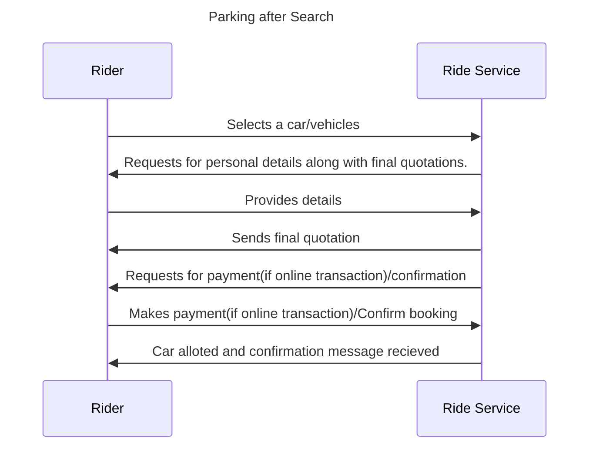

## Intercity Use Cases

### Introduction

Intercity travel refers to the movement of individuals or groups between cities, typically over longer distances. It involves journeying from one urban center to another, often across regions or states. Intercity travel serves various purposes, such as business trips, vacations, family visits, or any other travel needs that require crossing city or regional boundaries. Here's a comprehensive description of intercity travel:

Intercity travel forms an integral part of modern life, connecting distant places and facilitating mobility across geographical locations. It encompasses various modes of transportation, including buses, trains, airplanes, and private vehicles. This type of travel is characterized by its longer distances compared to intra-city commuting and often requires specialized services to cater to travelers' needs during extended journeys.

### Use Cases considered

- Intercity Cabs


### Workflow

#### Booking A Parking Slot (Search and Order)

**Step 1: Search for Intercity Travel Options**

- The buyer initiates a search for intercity travel options by sending a search message to the BPP (Beckn Partner Platform).
- The message includes the location and other relevant details for the starting and ending points of the journey.

**Step 2: Receive Result with Travel Options**

- The BPP processes the search request and responds with a result message containing a catalog of available intercity travel options.
- Each option includes details about the vehicle, its capacity, luggage capacity, provider information, schedule, and price.
**Step 3: Select a Travel Option**

- The buyer reviews the provided travel options and selects a preferred option based on their preferences, budget, and other requirements.
- The selected option's unique ID is noted for further processing.
**Step 4: Initialize the Booking**

- The buyer sends an init message to the BPP, indicating their intention to book the selected intercity travel option.
- The message includes the unique ID of the selected option, buyer's details, and any other required information.
**Step 5: Receive Booking Confirmation**

- The BPP processes the initialization request and responds with an init confirmation message, confirming the booking and providing further details.
- The message includes the booking ID, provider information, vehicle details, schedule, and payment instructions.
**Step 6: Confirm the Booking**

- The buyer reviews the provided booking details and confirms the booking by sending a confirm message to the BPP.
- The confirmation indicates the buyer's commitment to proceed with the booked intercity travel option.
**Step 7: Receive Confirmation Acknowledgment**

- The BPP processes the confirmation and responds with a confirmation acknowledgment message.
- The message confirms that the booking has been successfully acknowledged and processed.
**Step 8: Receive Status Updates**

- Throughout the journey, the BPP and the provider may send status updates to keep the buyer informed about the progress of the booked intercity travel.
- Updates may include information about the vehicle's location, estimated time of arrival, and other relevant details.
**Step 9: Complete the Journey**

- The buyer travels as per the booked intercity travel option's schedule and details.

```mermaid 
sequenceDiagram
    sequenceDiagram
    title Search Ride
    participant Rider
    participant BG
    participant Ride Service
    Rider->>BG: Submits details such as start and end location
    BG->>Ride Service: Searching for intercity services 
    Ride Service ->> BG :Returns available intercity services 
    BG->>Ride Service 2: Searching for intercity vehicles 
    Ride Service 2 ->> BG :Returns available intercity vehicles  
    BG->>Rider: Compiled list of intercity vehicles
```



#### POST FULFILLMENT

**Step 1: Payment(if post-fulfilment)**

- After completing the journey, the BPP may send a post-fulfillment message with payment instructions to the buyer.
- The buyer follows the payment instructions to settle the payment for the provided service.

**Step 2: Status update**

- The ride would be shown completed and the vehicle would be available again in search.

**Step 3: Feedback(optional)**

- Additionally, the buyer may provide feedback or rate the service using the BECKN protocol's feedback mechanisms.


### Example Jsons

#### An example `search` request 

```
{
    "context": {
      "country": "IND",
      "bpp_uri": "https://api.example-bpp.com/intercity/beckn/search",
      "domain": "nic2004:60221",
      "timestamp": "2023-07-13T12:00:00Z",
      "bap_id": "example-bap.com",
      "bpp_id": "example-bpp.com",
      "transaction_id": "e1f94247-76a3-48c9-8f04-7c95d4b5e1b1",
      "message_id": "4b38c01a-4a59-4f11-b44a-2303cc50f789",
      "city": "std:011",
      "core_version": "1.1.0",
      "action": "search",
      "bap_uri": "https://api.example-bap.com/pilot/bap/intercity/v1"
    },
    "message": {
      "query": {
        "start": {
          "location": {
            "gps": "28.6139, 77.2090"
          },
          "time": {
            "timestamp": "2023-07-15T08:00:00Z"
          }
        },
        "end": {
          "location": {
            "gps": "19.0760, 72.8777"
          }
        },
        "vehicle": {
          "category": "CAR",
          "seats": 4
        }
      }
    }
  }
   
```

#### An example `on_search` callback

``` 
{
    "context": {
      "country": "IND",
      "bpp_uri": "https://api.example-bpp.com/intercity/beckn/search",
      "domain": "nic2004:60221",
      "timestamp": "2023-07-13T12:05:30Z",
      "bap_id": "example-bap.com",
      "bpp_id": "example-bpp.com",
      "transaction_id": "e1f94247-76a3-48c9-8f04-7c95d4b5e1b1",
      "message_id": "5f7a964b-2450-4e5e-b399-0d9b947c821b",
      "city": "std:011",
      "core_version": "1.1.0",
      "action": "on_search",
      "bap_uri": "https://api.example-bap.com/pilot/bap/intercity/v1"
    },
    "message": {
      "catalog": {
        "descriptor": {
          "name": "Inter-City Transportation Services",
          "images": [
            {
              "url": "https://example-bpp.com/images/logos/intercity.ico"
            }
          ]
        },
        "providers": [
          {
            "provider": {
              "id": "56789",
              "descriptor": {
                "name": "XYZ Intercity Transport Service"
              }
            },
            "items": [
              {
                "id": "vehicle_1",
                "category": "CAR",
                "seats": 4,
                "features": [
                  {
                    "name": "Air Conditioning",
                    "description": "Comfortable AC cars for your journey."
                  },
                  {
                    "name": "English-Speaking Driver",
                    "description": "Drivers fluent in English for better communication."
                  }
                ],
                "price": {
                  "value": "25000",
                  "currency": "INR"
                }
              },
              {
                "id": "vehicle_2",
                "category": "SUV",
                "seats": 6,
                "features": [
                  {
                    "name": "Spacious",
                    "description": "Roomy SUVs with ample space for luggage."
                  }
                ],
                "price": {
                  "value": "32000",
                  "currency": "INR"
                }
              }  
            ],
            "pickup": {
              "location": {
                "gps": "28.6139, 77.2090",
                "address": {
                  "area": "Connaught Place",
                  "city": "New Delhi",
                  "state": "Delhi",
                  "country": "India",
                  "zip_code": "110001"
                }
              },
              "time": {
                "timestamp": "2023-07-15T08:00:00Z"
              }
            },
            "dropoff": {
              "location": {
                "gps": "19.0760, 72.8777",
                "address": {
                  "area": "Colaba",
                  "city": "Mumbai",
                  "state": "Maharashtra",
                  "country": "India",
                  "zip_code": "400005"
                }
              }
            }
          },
          {
            "id": "2",
            "descriptor": {
              "name": "Comfort Rides",
              "images": [
                {
                  "url": "https://example-bpp.com/images/logos/comfortrides.ico"
                }
              ]
            },
            "items": [
              {
                "id": "vehicle_3",
                "category": "SUV",
                "seats": 6,
                "features": [
                  {
                    "name": "Wi-Fi",
                    "description": "Stay connected with complimentary Wi-Fi on-board."
                  },
                  {
                    "name": "Refreshments",
                    "description": "Enjoy complimentary refreshments during the journey."
                  }
                ],
                "price": {
                  "value": "35000",
                  "currency": "INR"
                }
              }
            ],
            "pickup": {
              "location": {
                "gps": "28.6139, 77.2090",
                "address": {
                  "area": "Connaught Place",
                  "city": "New Delhi",
                  "state": "Delhi",
                  "country": "India",
                  "zip_code": "110001"
                }
              },
              "time": {
                "timestamp": "2023-07-15T08:00:00Z"
              }
            },
            "dropoff": {
              "location": {
                "gps": "19.0760, 72.8777",
                "address": {
                  "area": "Colaba",
                  "city": "Mumbai",
                  "state": "Maharashtra",
                  "country": "India",
                  "zip_code": "400005"
                }
              }
            }
          }
        ]
      }
    }
  }
  
```

#### An example `select` request 

``` 
{
    "context": {
      "country": "IND",
      "bpp_uri": "https://api.example-bpp.com/intercity/beckn/select",
      "domain": "nic2004:60221",
      "timestamp": "2023-07-13T12:30:00Z",
      "bap_id": "example-bap.com",
      "bpp_id": "example-bpp.com",
      "transaction_id": "e1f94247-76a3-48c9-8f04-7c95d4b5e1b1",
      "message_id": "e6213d27-cb36-4212-8c03-aae967f7ed9f",
      "city": "std:011",
      "core_version": "1.1.0",
      "action": "select",
      "bap_uri": "https://api.example-bap.com/pilot/bap/intercity/v1"
    },
    "message": {
      "order": {
        "id": "78ad0f0f-5411-4d3c-827d-94f4978e73be",
        "provider": {
          "id": "56789",
          "descriptor": {
            "name": "XYZ Intercity Transport Service"
          }
        },
        "items": [
          {
            "id": "vehicle_1",
            "descriptor": {
              "name": "FastRide CAR"
            },
            "price": {
              "value": "25000",
              "currency": "INR"
            }
          }
        ],
        "pickup": {
          "location": {
            "gps": "28.6139, 77.2090",
            "address": {
              "area": "Connaught Place",
              "city": "New Delhi",
              "state": "Delhi",
              "country": "India",
              "zip_code": "110001"
            }
          },
          "time": {
            "timestamp": "2023-07-15T08:00:00Z"
          }
        },
        "dropoff": {
          "location": {
            "gps": "19.0760, 72.8777",
            "address": {
              "area": "Colaba",
              "city": "Mumbai",
              "state": "Maharashtra",
              "country": "India",
              "zip_code": "400005"
            }
          }
        }
      }
    }
  }
  
```

#### An example `on_select` callback

``` 
{
    "context": {
      "country": "IND",
      "bpp_uri": "https://api.example-bpp.com/intercity/beckn/on_select",
      "domain": "nic2004:60221",
      "timestamp": "2023-07-13T12:35:00Z",
      "bap_id": "example-bap.com",
      "bpp_id": "example-bpp.com",
      "transaction_id": "e1f94247-76a3-48c9-8f04-7c95d4b5e1b1",
      "message_id": "4ad17e92-15e1-4d17-9911-5a983c34a6ec",
      "city": "std:011",
      "core_version": "1.1.0",
      "action": "on_select",
      "bap_uri": "https://api.example-bap.com/pilot/bap/intercity/v1"
    },
    "message": {
      "order": {
        "id": "78ad0f0f-5411-4d3c-827d-94f4978e73be",
        "provider": {
        "id": "56789",
        "descriptor": {
          "name": "XYZ Intercity Transport Service"
        }
      },
        "items": [
          {
            "id": "vehicle_1",
            "descriptor": {
              "name": "FastRide CAR"
            },
            "price": {
              "value": "25000",
              "currency": "INR"
            }
          }
        ],
        "pickup": {
          "location": {
            "gps": "28.6139, 77.2090",
            "address": {
              "area": "Connaught Place",
              "city": "New Delhi",
              "state": "Delhi",
              "country": "India",
              "zip_code": "110001"
            }
          },
          "time": {
            "timestamp": "2023-07-15T08:00:00Z"
          }
        },
        "dropoff": {
          "location": {
            "gps": "19.0760, 72.8777",
            "address": {
              "area": "Colaba",
              "city": "Mumbai",
              "state": "Maharashtra",
              "country": "India",
              "zip_code": "400005"
            }
          }
        },
        "fulfillment": {
          "id": "fb5c84d4-1b59-4b9d-96b5-9d79107432c5",
          "end": {
            "time": {
              "timestamp": "2023-07-15T18:00:00Z"
            }
          }
        },
        "quote": {
          "price": {
            "currency": "INR",
            "value": "25000"
          }
        }
      }
    }
  }
  
```

#### An example `init` callback 

``` 
{
    "context": {
      "country": "IND",
      "bpp_uri": "https://api.example-bpp.com/intercity/beckn/on_search",
      "domain": "nic2004:60221",
      "timestamp": "2023-07-13T10:30:00Z",
      "bap_id": "example-bap.com",
      "bpp_id": "example-bpp.com",
      "transaction_id": "f4352982-9c82-4b06-a7f9-8ed44c1ae6e1",
      "message_id": "1257d42f-1208-40d2-837f-1ef3c7d4173f",
      "city": "std:011",
      "core_version": "1.1.0",
      "action": "on_init",
      "bap_uri": "https://api.example-bap.com/pilot/bap/intercity/v1"
    },
    "message": {
      "description": "Intercity Transportation Request",
      "items": [
        {
          "id": "vehicle_1",
          "descriptor": {
            "name": "FastRide CAR"
          },
          "price": {
            "value": "25000",
            "currency": "INR"
          }
        }
      ],
      "provider": {
        "id": "56789",
        "descriptor": {
          "name": "XYZ Intercity Transport Service"
        }
      },
      "customer": {
        "person": {
          "name": "John Doe",
          "phone": "+91-9897867564",
          "email": "john.doe@example.com"
        }
      },
      "category": "TRANSPORT",
      "fulfillment": {
        "start": {
          "location": {
            "gps": "28.6139, 77.2090",
            "address": {
              "area": "Connaught Place",
              "city": "New Delhi",
              "state": "Delhi",
              "country": "India",
              "zip_code": "110001"
            }
          },
          "time": {
            "timestamp": "2023-07-15T08:00:00Z"
          }
        },
        "end": {
          "location": {
            "gps": "19.0760, 72.8777",
            "address": {
              "area": "Colaba",
              "city": "Mumbai",
              "state": "Maharashtra",
              "country": "India",
              "zip_code": "400005"
            }
          }
        }
      },
      "quote": {
        "value": "25000",
        "currency": "INR",
        "breakup": [
          {
            "title": "Base Fare",
            "price": {
              "value": "20000",
              "currency": "INR"
            }
          },
          {
            "title": "Driver overnight charges",
            "price": {
              "value": "500",
              "currency": "INR"
            }
          }
        ]
      },
      "payment": {
        "type": "POST-FULFILLMENT",
        "status": "NOT-PAID",
        "params": {
          "amount": "25000",
          "currency": "INR"
        },
        "time": {
          "duration": "P1D"
        }
      }
    }
  }
  
```

#### An example `on_init` request

``` 
{
    "context": {
      "country": "IND",
      "bpp_uri": "https://api.example-bpp.com/intercity/beckn/on_search",
      "domain": "nic2004:60221",
      "timestamp": "2023-07-13T10:30:00Z",
      "bap_id": "example-bap.com",
      "bpp_id": "example-bpp.com",
      "transaction_id": "f4352982-9c82-4b06-a7f9-8ed44c1ae6e1",
      "message_id": "1257d42f-1208-40d2-837f-1ef3c7d4173f",
      "city": "std:011",
      "core_version": "1.1.0",
      "action": "on_init",
      "bap_uri": "https://api.example-bap.com/pilot/bap/intercity/v1"
    },
    "message": {
      "description": "Intercity Transportation Request",
      "items": [
        {
          "id": "vehicle_1",
          "descriptor": {
            "name": "FastRide CAR"
          },
          "price": {
            "value": "25000",
            "currency": "INR"
          }
        }
      ],
      "provider": {
        "id": "56789",
        "descriptor": {
          "name": "XYZ Intercity Transport Service"
        }
      },
      "customer": {
        "person": {
          "name": "John Doe",
          "phone": "+91-9897867564",
          "email": "john.doe@example.com"
        }
      },
      "category": "TRANSPORT",
      "fulfillment": {
        "start": {
          "location": {
            "gps": "28.6139, 77.2090",
            "address": {
              "area": "Connaught Place",
              "city": "New Delhi",
              "state": "Delhi",
              "country": "India",
              "zip_code": "110001"
            }
          },
          "time": {
            "timestamp": "2023-07-15T08:00:00Z"
          }
        },
        "end": {
          "location": {
            "gps": "19.0760, 72.8777",
            "address": {
              "area": "Colaba",
              "city": "Mumbai",
              "state": "Maharashtra",
              "country": "India",
              "zip_code": "400005"
            }
          }
        }
      },
      "quote": {
        "value": "25000",
        "currency": "INR",
        "breakup": [
          {
            "title": "Base Fare",
            "price": {
              "value": "20000",
              "currency": "INR"
            }
          },
          {
            "title": "Driver overnight charges",
            "price": {
              "value": "500",
              "currency": "INR"
            }
          }
        ]
      },
      "payment": {
        "type": "POST-FULFILLMENT",
        "status": "NOT-PAID",
        "params": {
          "amount": "25000",
          "currency": "INR"
        },
        "time": {
          "duration": "P1D"
        }
      }
    }
  }
  
```

#### An example `confirm` request 

``` 
{
    "context": {
      "country": "IND",
      "bpp_uri": "https://api.example-bpp.com/intercity/beckn/on_search",
      "domain": "nic2004:60221",
      "timestamp": "2023-07-13T10:30:00Z",
      "bap_id": "example-bap.com",
      "bpp_id": "example-bpp.com",
      "transaction_id": "f4352982-9c82-4b06-a7f9-8ed44c1ae6e1",
      "message_id": "1257d42f-1208-40d2-837f-1ef3c7d4173f",
      "city": "std:011",
      "core_version": "1.1.0",
      "action": "confirm",
      "bap_uri": "https://api.example-bap.com/pilot/bap/intercity/v1"
    },
    "message": {
      "description": "Intercity Transportation Request Confirmation",
      "order": {
        "id": "12345",
        "provider": {
          "id": "56789",
          "descriptor": {
            "name": "XYZ Intercity Transport Service"
          }
        },
        "items": [
            {
                "id": "vehicle_1",
                "descriptor": {
                  "name": "FastRide CAR"
                },
                "price": {
                  "value": "25000",
                  "currency": "INR"
                }
              }
        ],
        "fulfillment": {
          "id": "54321",
          "start": {
            "location": {
              "gps": "28.6139, 77.2090",
              "address": {
                "area": "Connaught Place",
                "city": "New Delhi",
                "state": "Delhi",
                "country": "India",
                "zip_code": "110001"
              }
            },
            "time": {
              "timestamp": "2023-07-15T08:00:00Z"
            }
          },
          "end": {
            "location": {
              "gps": "19.0760, 72.8777",
              "address": {
                "area": "Colaba",
                "city": "Mumbai",
                "state": "Maharashtra",
                "country": "India",
                "zip_code": "400005"
              }
            }
          }
        },
        "billing": {
          "name": "John Doe",
          "email": "john.doe@example.com",
          "phone": "+91-9897867564"
        },
        "quote": {
          "price": {
            "currency": "INR",
            "value": "25000"
          }
        },
        "payment": {
          "type": "POST-FULFILLMENT",
          "status": "NOT-PAID",
          "params": {
            "amount": "25000",
            "currency": "INR"
          },
          "time": {
            "duration": "P1D"
          }
        }
      }
    }
  }
  
```

#### An example `on_confirm` callback 

``` 
{
    "context": {
      "country": "IND",
      "bpp_uri": "https://api.example-bpp.com/intercity/beckn/on_search",
      "domain": "nic2004:60221",
      "timestamp": "2023-07-13T10:30:00Z",
      "bap_id": "example-bap.com",
      "bpp_id": "example-bpp.com",
      "transaction_id": "f4352982-9c82-4b06-a7f9-8ed44c1ae6e1",
      "message_id": "1257d42f-1208-40d2-837f-1ef3c7d4173f",
      "city": "std:011",
      "core_version": "1.1.0",
      "action": "on_confirm",
      "bap_uri": "https://api.example-bap.com/pilot/bap/intercity/v1"
    },
    "message": {
      "order": {
        "id": "12345",
        "provider": {
          "id": "56789",
          "descriptor": {
            "name": "XYZ Intercity Transport Service"
          }
        },
        "items": [
            {
                "id": "vehicle_1",
                "descriptor": {
                  "name": "FastRide CAR"
                },
                "price": {
                  "value": "25000",
                  "currency": "INR"
                }
              }
        ],
        "fulfillment": {
          "id": "54321",
          "start": {
            "location": {
              "gps": "28.6139, 77.2090",
              "address": {
                "area": "Connaught Place",
                "city": "New Delhi",
                "state": "Delhi",
                "country": "India",
                "zip_code": "110001"
              }
            },
            "time": {
              "timestamp": "2023-07-15T08:00:00Z"
            }
          },
          "end": {
            "location": {
              "gps": "19.0760, 72.8777",
              "address": {
                "area": "Colaba",
                "city": "Mumbai",
                "state": "Maharashtra",
                "country": "India",
                "zip_code": "400005"
              }
            }
          }
        },
        "billing": {
          "name": "John Doe",
          "email": "john.doe@example.com",
          "phone": "+91-9897867564"
        },
        "quote": {
          "price": {
            "currency": "INR",
            "value": "25000"
          }
        },
        "payment": {
          "type": "POST-FULFILLMENT",
          "status": "NOT-PAID",
          "params": {
            "amount": "25000",
            "currency": "INR"
          },
          "time": {
            "duration": "P1D"
          }
        }
      }
    }
  }
  
```

#### STATUS UPDATES

#### An example `status` request
``` 
{
    "context": {
      "country": "IND",
      "bpp_uri": "https://api.car-rental-provider.com/beckn/7f7896dd-787e-4a0b-8675-e9e6fe93bb8f",
      "domain": "nic2004:60221",
      "timestamp": "2023-03-23T04:48:53Z",
      "bap_id": "example-bap.com",
      "bpp_id": "example-bpp.com",
      "transaction_id": "b580c989-f84d-4abe-af28-2c818aafce3b",
      "message_id": "8926b747-0362-4fcc-b795-0994a6287700",
      "city": "std:080",
      "core_version": "1.1.0",
      "action": "status",
      "bap_uri": "https://mock_bap.com/beckn/"
    },
    "message": {
      "order_id": "7751bd26-3fdc-47ca-9b64-e998dc5abe68"
    }
  }
```

#### An example `on_status` callback

- Case Ride started

``` 
{
    "context": {
      "country": "IND",
      "bpp_uri": "https://api.example-bpp.com/intercity/beckn/on_search",
      "domain": "nic2004:60221",
      "timestamp": "2023-07-13T10:35:00Z",
      "bap_id": "example-bap.com",
      "bpp_id": "example-bpp.com",
      "transaction_id": "f4352982-9c82-4b06-a7f9-8ed44c1ae6e1",
      "message_id": "1257d42f-1208-40d2-837f-1ef3c7d4173f",
      "city": "std:011",
      "core_version": "1.1.0",
      "action": "on_status",
      "bap_uri": "https://api.example-bap.com/pilot/bap/intercity/v1"
    },
    "message": {
      "description": "Intercity Transportation Ride Status",
      "order": {
        "id": "12345",
        "provider": {
          "id": "56789",
          "descriptor": {
            "name": "XYZ Intercity Transport Service"
          }
        },
        "items": [
          {
            "id": "vehicle_1",
            "descriptor": {
              "name": "FastRide CAR"
            },
            "price": {
              "value": "25000",
              "currency": "INR"
            }
          }
        ],
        "fulfillment": {
            "id": "fulf_5cf064d5-4c0a-42d3-b73d-5f19a6f7468e",
            "state": {
              "descriptor": {
                "code": "INTERCITY_STARTED",
                "name": "Your intercity ride has started."
              }
            },
            "stops": [
              {
                "authorization": {
                  "type": "OTP",
                  "token": "234234"
                },
                "location": {
                    "gps": "28.6139, 77.2090",
                    "address": {
                      "area": "Connaught Place",
                      "city": "New Delhi",
                      "state": "Delhi",
                      "country": "India",
                      "zip_code": "110001"
                    }
                  }
              },
              {
                "location": {
                    "gps": "19.0760, 72.8777",
                    "address": {
                      "area": "Colaba",
                      "city": "Mumbai",
                      "state": "Maharashtra",
                      "country": "India",
                      "zip_code": "400005"
                    }
                  }
              }
            ],
            "agent": {
                "name": "John Smith",
                "phone": "+9876543210",
              "rateable": true,
              "rating": "5"
            },
            "vehicle": {
              "category": "CAR",
              "registration": "KA01JG1231"
            },
            "customer": {
              "person": {
                "name": "John Doe",
                "phone": "+91-9897867564",
                "tags": [
                  {
                    "descriptor": {
                      "name": "Localization"
                    },
                    "list": [
                      {
                        "descriptor": {
                          "name": "Language"
                        },
                        "value": "en"
                      }
                    ],
                    "display": false
                  }
                ]
              }
            }
          },
        "quote": {
          "price": {
            "currency": "INR",
            "value": "25000"
          }
        },
        "payment": {
          "type": "POST-FULFILLMENT",
          "status": "NOT-PAID",
          "params": {
            "amount": "25000",
            "currency": "INR"
          },
          "time": {
            "duration": "P1D"
          }
        }
      },
      "customer": {
        "person": {
            "name": "John Doe",
            "email": "john.doe@example.com",
            "phone": "+91-9897867564",
          "tags": [
            {
              "descriptor": {
                "name": "Localization"
              },
              "list": [
                {
                  "descriptor": {
                    "name": "Language"
                  },
                  "value": "en"
                }
              ],
              "display": false
            }
          ]
        }
      }
    }
  }
```

- Case Ride ended

``` 
{
    "context": {
      "country": "IND",
      "bpp_uri": "https://api.example-bpp.com/intercity/beckn/on_search",
      "domain": "nic2004:60221",
      "timestamp": "2023-07-13T10:35:00Z",
      "bap_id": "example-bap.com",
      "bpp_id": "example-bpp.com",
      "transaction_id": "f4352982-9c82-4b06-a7f9-8ed44c1ae6e1",
      "message_id": "1257d42f-1208-40d2-837f-1ef3c7d4173f",
      "city": "std:011",
      "core_version": "1.1.0",
      "action": "on_status",
      "bap_uri": "https://api.example-bap.com/pilot/bap/intercity/v1"
    },
    "message": {
      "description": "Intercity Transportation Ride Status",
      "order": {
        "id": "12345",
        "provider": {
          "id": "56789",
          "descriptor": {
            "name": "XYZ Intercity Transport Service"
          }
        },
        "items": [
          {
            "id": "vehicle_1",
            "descriptor": {
              "name": "FastRide CAR"
            },
            "price": {
              "value": "25000",
              "currency": "INR"
            }
          }
        ],
        "fulfillment": {
            "id": "fulf_5cf064d5-4c0a-42d3-b73d-5f19a6f7468e",
            "state": {
              "descriptor": {
                "code": "INTERCITY_ENDED",
                "name": "Your intercity ride has ended."
              }
            },
            "stops": [
              {
                "authorization": {
                  "type": "OTP",
                  "token": "234234"
                },
                "location": {
                    "gps": "28.6139, 77.2090",
                    "address": {
                      "area": "Connaught Place",
                      "city": "New Delhi",
                      "state": "Delhi",
                      "country": "India",
                      "zip_code": "110001"
                    }
                  }
              },
              {
                "location": {
                    "gps": "19.0760, 72.8777",
                    "address": {
                      "area": "Colaba",
                      "city": "Mumbai",
                      "state": "Maharashtra",
                      "country": "India",
                      "zip_code": "400005"
                    }
                  }
              }
            ],
            "agent": {
                "name": "John Smith",
                "phone": "+9876543210",
              "rateable": true,
              "rating": "5"
            },
            "vehicle": {
              "category": "CAR",
              "registration": "KA01JG1231"
            },
            "customer": {
              "person": {
                "name": "John Doe",
                "phone": "+91-9897867564",
                "tags": [
                  {
                    "descriptor": {
                      "name": "Localization"
                    },
                    "list": [
                      {
                        "descriptor": {
                          "name": "Language"
                        },
                        "value": "en"
                      }
                    ],
                    "display": false
                  }
                ]
              }
            }
          },
        "quote": {
          "price": {
            "currency": "INR",
            "value": "25000"
          }
        },
        "payment": {
          "type": "POST-FULFILLMENT",
          "status": "NOT-PAID",
          "params": {
            "amount": "25000",
            "currency": "INR"
          },
          "time": {
            "duration": "P1D"
          }
        }
      },
      "customer": {
        "person": {
            "name": "John Doe",
            "email": "john.doe@example.com",
            "phone": "+91-9897867564",
          "tags": [
            {
              "descriptor": {
                "name": "Localization"
              },
              "list": [
                {
                  "descriptor": {
                    "name": "Language"
                  },
                  "value": "en"
                }
              ],
              "display": false
            }
          ]
        }
      }
    }
  }
  
```