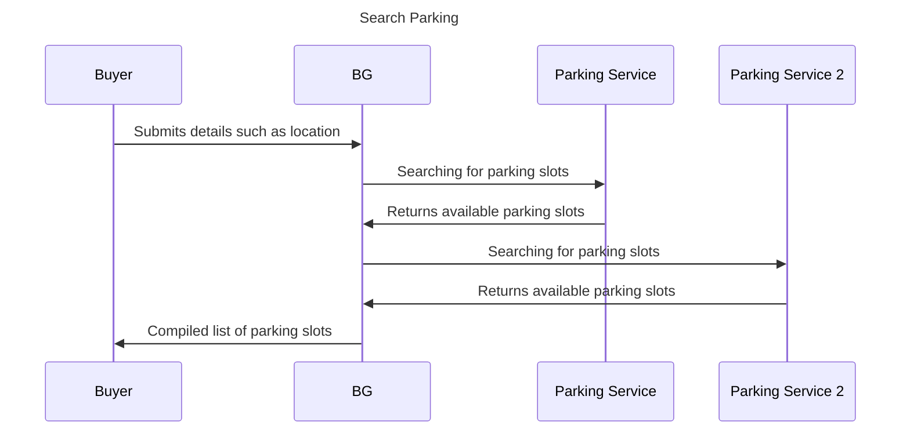
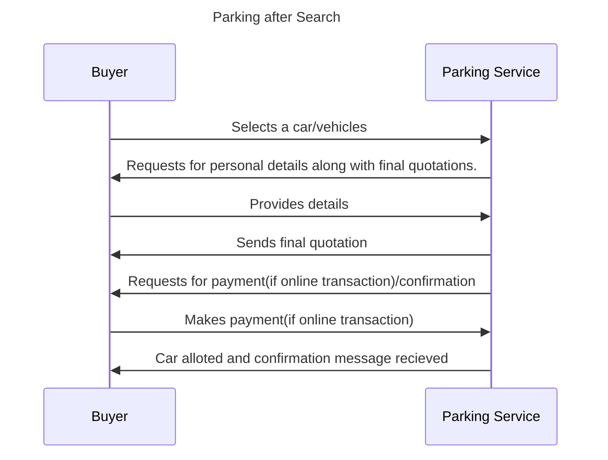
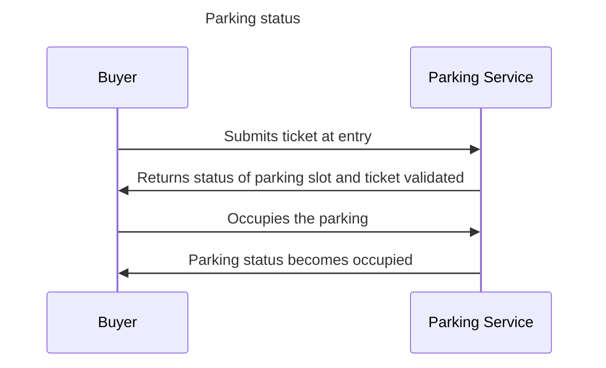

## Parking Use Cases

### Introduction

Parking is a service that offers individuals a designated area to safely and temporarily store their vehicles when they are not in use. It is an essential component of urban infrastructure, accommodating the transportation needs of people in densely populated areas. Parking facilities can vary widely in terms of size, location, features, and services offered.

Parking facilities can be found in various locations, including commercial areas, residential neighborhoods, entertainment venues, airports, and public transportation hubs. They play a crucial role in addressing the challenges of limited space and managing traffic congestion in urban environments.

### Use Cases considered

- Parking


### Workflow

#### Booking A Parking Slot (Search and Order)

**Step 1: Search for Parking Facilities**

- Buyer searches for available parking facilities near their current location using the BECKN search request.
- The request includes the buyer's location and preferences (e.g., covered parking, proximity to destination).

**Step 2: Receive Parking Options**

- BECKN responds with a list of available parking facilities along with their details, such as location, availability status, and pricing.

**Step 3: Check Parking Terms and conditions**

- The buyer reviews the parking terms and plans.

**Step 4: Select a Parking Facility**

- Buyer selects a parking facility based on their preferences and receives a parking token (unique identifier).

**Step 5: Submit required information**

-  Buyer provides personal information,chooses the parking slot, the time duration and option like open parking or closed including the location of the parking.

**Step 6: Get Quotations**

- The system calculates the total cost of the parking slot, including the base rate, taxes, fees, and selected add-ons and payment link(if mode is selected as online payment)

**Step 7: Make Final Payment(if online payment)**

- The buyer provides payment through the payment link recieved from the parking service.

**Step 8: Get Parking ticket**

- Buyer recieves the final confirmation message and details of the parking slot along with payment status.





#### After Booking(Fullfillment)


**Step 1: Arrive at the Parking Facility**

- Vehicle owner arrives at the parking facility.
- They approach the entrance of the parking lot.

**Step 2: Ticket Validation**

- The parking system validates the parking ticket and the slot alloted to the car.

**Step 3: Finding the allocated parking slot**

- The parking slot booked and mentioned on the ticket is found by the buyer and parking is done.

**Step 4: Status occupied**

- Status becomes occupied for the parking slot associated for the ticket.



#### POST FULFILLMENT

**Step 1: Exit the Parking Facility**

- The vehicle owner returns to their parked vehicle.
- They drive towards the exit gate.

**Step 2: Insert Ticket and Exit**

- At the exit gate, the vehicle owner inserts the validated parking ticket.
- The system raises the gate, allowing the vehicle to exit.
- If the payment was not made using online transaction then the payment is made.
- Also if time limit is exceeded then the additional charges are posted.

**Step 3: Retrieve Ticket (If Applicable)**

- Some parking facilities require the validated ticket to be inserted again at the exit.
- The ticket might be retained by the system or returned to the vehicle owner.

**Step 4: Exit**

- The vehicle owner exits the parking facility.
- The parking process is complete.


### Example Jsons

#### An example `search` request 

``` 
{
    "context": {
      "country": "IND",
      "bpp_uri": "https://api.example-bpp.com/intercity/beckn/search",
      "domain": "nic2004:60221",
      "timestamp": "2023-07-13T12:00:00Z",
      "bap_id": "example-bap.com",
      "bpp_id": "example-bpp.com",
      "transaction_id": "e1f94247-76a3-48c9-8f04-7c95d4b5e1b1",
      "message_id": "4b38c01a-4a59-4f11-b44a-2303cc50f789",
      "city": "std:011",
      "core_version": "1.1.0",
      "action": "search",
      "bap_uri": "https://api.example-bap.com/pilot/bap/intercity/v1"
    },
    "message": {
      "query": {
        "start": {
          "location": {
            "gps": "28.6139, 77.2090"
          },
          "time": {
            "timestamp": "2023-07-15T08:00:00Z"
          }
        }
      }
    }
  }
  
```

#### An example `on_search` callback

```
{
    "context": {
      "country": "IND",
      "bpp_uri": "https://api.example-bpp.in/path/to/url",
      "domain": "nic2004:60221",
      "timestamp": "2023-03-23T04:43:02Z",
      "bap_id": "example-bap.in",
      "transaction_id": "870782be-6757-43f1-945c-8eeaf9536259",
      "bpp_id": "example-bpp.in",
      "message_id": "21e54d3c-9c3b-47c1-aa3b-b0e7b20818ee",
      "city": "std:080",
      "core_version": "1.1.0",
      "action": "on_search",
      "bap_uri": "https://api.example-bpp.in/path/to/url"
    },
    "message": {
      "catalog": {
        "descriptor": {
          "name": "Parking Spaces",
          "images": [
            {
              "url": "https://example-bpp.com/images/logos/parking.ico"
            }
          ]
        },
        "providers": [
          {
            "descriptor": {
              "name": "City Parking",
              "images": [
                {
                  "url": "https://example-bpp.com/images/logos/city_parking.ico"
                }
              ]
            },
            "items": [
              {
                "id": "1",
                "descriptor": {
                  "name": "Hourly Parking"
                },
                "price": {
                  "value": "50",
                  "currency": "INR"
                },
                "fulfillment_ids": [
                  "1"
                ],
                "payment_ids": [
                  "1"
                ]
              },
              {
                "id": "2",
                "descriptor": {
                  "name": "Daily Parking"
                },
                "price": {
                  "value": "300",
                  "currency": "INR"
                },
                "fulfillment_ids": [
                  "2"
                ],
                "payment_ids": [
                  "1"
                ]
              },
              {
                "id": "3",
                "descriptor": {
                  "name": "Monthly Parking"
                },
                "price": {
                  "value": "2000",
                  "currency": "INR"
                },
                "fulfillment_ids": [
                  "3"
                ],
                "payment_ids": [
                  "1"
                ]
              }
            ],
            "fulfillments": [
              {
                "id": "1",
                "stops": [
                  {
                    "location": {
                      "descriptor": {
                        "name": "Parking Lot 1"
                      },
                      "gps": "12.9099828, 77.6118226"
                    }
                  }
                ],
                "vehicle": {
                  "category": "PARKING_SPACE"
                }
              },
              {
                "id": "2",
                "stops": [
                  {
                    "location": {
                      "descriptor": {
                        "name": "Parking Lot 2"
                      },
                      "gps": "12.9351856, 77.6245996"
                    }
                  }
                ],
                "vehicle": {
                  "category": "PARKING_SPACE"
                }
              },
              {
                "id": "3",
                "stops": [
                  {
                    "location": {
                      "descriptor": {
                        "name": "Parking Lot 3"
                      },
                      "gps": "12.9201354, 77.6086488"
                    }
                  }
                ],
                "vehicle": {
                  "category": "PARKING_SPACE"
                }
              }
            ],
            "payments": [
              {
                "id": "1",
                "type": "ON-FULFILLMENT",
                "collected_by": "BPP"
              }
            ]
          },
          {
            "descriptor": {
              "name": "Secure Parking",
              "images": [
                {
                  "url": "https://example-bpp.com/images/logos/secure_parking.ico"
                }
              ]
            },
            "items": [
              {
                "id": "1",
                "descriptor": {
                  "name": "Standard Parking"
                },
                "price": {
                  "value": "40",
                  "currency": "INR"
                },
                "fulfillment_ids": [
                  "4"
                ],
                "payment_ids": [
                  "1"
                ]
              },
              {
                "id": "2",
                "descriptor": {
                  "name": "Premium Parking"
                },
                "price": {
                  "value": "80",
                  "currency": "INR"
                },
                "fulfillment_ids": [
                  "5"
                ],
                "payment_ids": [
                  "1"
                ]
              }
            ],
            "fulfillments": [
              {
                "id": "4",
                "stops": [
                  {
                    "location": {
                      "descriptor": {
                        "name": "Parking Lot 4"
                      },
                      "gps": "12.9015373, 77.5872352"
                    }
                  }
                ],
                "vehicle": {
                  "category": "PARKING_SPACE"
                }
              },
              {
                "id": "5",
                "stops": [
                  {
                    "location": {
                      "descriptor": {
                        "name": "Parking Lot 5"
                      },
                      "gps": "12.9037888, 77.5917664"
                    }
                  }
                ],
                "vehicle": {
                  "category": "PARKING_SPACE"
                }
              }
            ],
            "payments": [
              {
                "id": "1",
                "type": "ON-FULFILLMENT",
                "collected_by": "BPP"
              }
            ]
          }
        ]
      }
    }
  }
  
```

#### An example `select` request 

```
{
    "context": {
      "country": "IND",
      "bpp_uri": "https://api.example-bpp.in/path/to/url",
      "domain": "nic2004:60221",
      "timestamp": "2023-07-13T10:15:00Z",
      "bap_id": "example-bap.in",
      "bpp_id": "example-bpp.in",
      "transaction_id": "a1b2c3d4e5f6",
      "message_id": "abcdef123456",
      "city": "std:080",
      "core_version": "1.1.0",
      "action": "select",
      "bap_uri": "https://api.example-bap.in/path/to/url"
    },
    "message": {
      "order": {
        "id": "a1b2c3d4e5f6",
        "provider": {
          "id": "c1d2e3f4g5h6",
          "descriptor": {
            "name": "City Parking"
          }
        },
        "items": [
          {
            "id": "1",
            "descriptor": {
              "name": "Hourly Parking"
            },
            "price": {
              "value": "50",
              "currency": "INR"
            },
            "fulfillment_ids": ["1"],
            "payment_ids": ["1"]
          },
          {
            "id": "2",
            "descriptor": {
              "name": "Daily Parking"
            },
            "price": {
              "value": "150",
              "currency": "INR"
            },
            "fulfillment_ids": ["2"],
            "payment_ids": ["1"]
          },
          {
            "id": "3",
            "descriptor": {
              "name": "Monthly Parking"
            },
            "price": {
              "value": "2000",
              "currency": "INR"
            },
            "fulfillment_ids": ["3"],
            "payment_ids": ["1"]
          }
        ],
        "fulfillment": {
          "id": "1",
          "stops": [
            {
              "location": {
                "descriptor": {
                  "name": "Parking Lot 1"
                },
                "gps": "12.9099828, 77.6118226"
              }
            }
          ]
        }
      }
    }
  }
  
```

#### An example `on_select` callback

```
{
    "context": {
      "country": "IND",
      "bpp_uri": "https://api.example-bpp.in/path/to/url",
      "domain": "nic2004:60221",
      "timestamp": "2023-07-13T10:30:00Z",
      "bap_id": "example-bap.in",
      "bpp_id": "example-bpp.in",
      "transaction_id": "a1b2c3d4e5f6",
      "message_id": "abcdef123456",
      "city": "std:080",
      "core_version": "1.1.0",
      "action": "on_select",
      "bap_uri": "https://api.example-bap.in/path/to/url"
    },
    "message": {
      "order": {
        "id": "a1b2c3d4e5f6",
        "provider": {
          "id": "c1d2e3f4g5h6",
          "descriptor": {
            "name": "City Parking"
          }
        },
        "items": [
            {
              "id": "1",
              "descriptor": {
                "name": "Hourly Parking"
              },
              "price": {
                "value": "50",
                "currency": "INR"
              },
              "fulfillment_ids": ["1"],
              "payment_ids": ["1"]
            },
            {
              "id": "2",
              "descriptor": {
                "name": "Daily Parking"
              },
              "price": {
                "value": "150",
                "currency": "INR"
              },
              "fulfillment_ids": ["2"],
              "payment_ids": ["1"]
            },
            {
              "id": "3",
              "descriptor": {
                "name": "Monthly Parking"
              },
              "price": {
                "value": "2000",
                "currency": "INR"
              },
              "fulfillment_ids": ["3"],
              "payment_ids": ["1"]
            }
          ],
        "fulfillment": {
          "id": "1",
          "stops": [
            {
              "location": {
                "descriptor": {
                  "name": "Parking Lot 1"
                },
                "gps": "12.9099828, 77.6118226"
              }
            }
          ],
          "vehicle": {
            "category": "SUV"
          }
        }
      }
    }
  }
  
```

#### An example `init` callback 

```
{
    "context": {
      "country": "IND",
      "bpp_uri": "https://api.example-bpp.in/path/to/url",
      "domain": "nic2004:60221",
      "timestamp": "2023-07-13T10:00:00Z",
      "bap_id": "example-bap.in",
      "bpp_id": "example-bpp.in",
      "transaction_id": "abcdef123456",
      "message_id": "a1b2c3d4e5f6",
      "city": "std:080",
      "core_version": "1.1.0",
      "action": "init",
      "bap_uri": "https://api.example-bap.in/path/to/url"
    },
    "message": {
        "order": {
          "items": [
            {
              "id": "1"
            }
          ],
          "provider": {
            "id": "1"
          },
          "billing": {
            "name": "John Doe",
            "email": "john.doe@example.com"
          }
        }
      }
  }
  
```

#### An example `0n_init` request

```
{
    "context": {
      "domain": "nic2008:49213",
      "country": "IND",
      "city": "std:011",
      "action": "on_init",
      "core_version": "1.1.0",
      "bap_id": "example-bap.com",
      "bap_uri": "https://api.example-bap.in/path/to/url",
      "bpp_id": "example-bpp.com",
      "bpp_uri": "https://api.example-bpp.in/path/to/url",
      "transaction_id": "6f339232-2bc3-44d2-915c-30d2b053ce1d",
      "message_id": "fde8b8b6-c2e5-49f7-b254-720843d528bd",
      "timestamp": "2021-03-23T10:00:40.065Z"
    },
    "message": {
      "order": {
        "items": [
          {
            "id": "2",
            "descriptor": {
              "name": "Daily Parking",
              "images": [
                {
                  "url": "https://example-bpp.com/images/parking_daily.ico"
                }
              ]
            },
            "fulfillment_ids": [
              "2"
            ],
            "price": {
              "currency": "INR",
              "value": "150"
            },
            "tags": [
              {
                "list": [
                  {
                    "descriptor": {
                      "name": "Duration"
                    },
                    "value": "24 hours"
                  },
                  {
                    "descriptor": {
                      "name": "Location"
                    },
                    "value": "XYZ Parking Lot, ABC Street"
                  }
                ]
              }
            ]
          }
        ],
        "provider": {
          "id": "1",
          "descriptor": {
            "name": "City Parking",
            "images": [
              {
                "url": "https://example-bpp.com/images/logos/city_parking.ico"
              }
            ]
          }
        }
      }
    }
  }
  
```

#### An example `confirm` request 

```
{
    "context": {
      "domain": "nic2008:49213",
      "country": "IND",
      "city": "std:011",
      "action": "confirm",
      "core_version": "1.1.0",
      "bap_id": "example-bap.com",
      "bap_uri": "https://api.example-bap.in/path/to/url",
      "bpp_id": "example-bpp.com",
      "bpp_uri": "https://api.example-bpp.in/path/to/url",
      "transaction_id": "6f339232-2bc3-44d2-915c-30d2b053ce1d",
      "message_id": "fde8b8b6-c2e5-49f7-b254-720843d528bd",
      "timestamp": "2021-03-23T10:00:40.065Z"
    },
    "message": {
      "order": {
        "id": "7751bd26-3fdc-47ca-9b64-e998dc5abe68",
        "provider": {
          "id": "1",
          "descriptor": {
            "name": "City Parking",
            "images": [
              {
                "url": "https://example-bpp.com/images/logos/city_parking.ico"
              }
            ]
          }
        },
        "items": [
          {
            "id": "2",
            "descriptor": {
              "name": "Daily Parking",
              "images": [
                {
                  "url": "https://parking-solutions.com/icons/daily_parking.ico"
                }
              ]
            },
            "fulfillment_ids": ["2"],
            "price": {
              "currency": "INR",
              "value": "150"
            },
            "tags": [
              {
                "list": [
                  {
                    "descriptor": {
                      "name": "Duration"
                    },
                    "value": "24 hours"
                  },
                  {
                    "descriptor": {
                      "name": "Location"
                    },
                    "value": "ABC Parking Lot, XYZ Street"
                  }
                ]
              }
            ]
          }
        ],
        "billing": {
          "name": "John Doe",
          "email": "john.doe@example.com"
        },
        "payment": {
          "id": "7f7896dd-787e-4a0b-8675-e9e6fe93bb8f",
          "type": "ON-FULFILLMENT",
          "params": {
            "amount": "150",
            "currency": "INR",
            "transaction_status": "NOT-PAID"
          }
        }
      }
    }
  }
  
```

#### An example `on_confirm` callback 

```
{
    "context": {
      "domain": "nic2008:49213",
      "country": "IND",
      "city": "std:011",
      "action": "on_confirm",
      "core_version": "1.1.0",
      "bap_id": "example-bap.com",
      "bap_uri": "https://api.example-bap.in/path/to/url",
      "bpp_id": "example-bpp.com",
      "bpp_uri": "https://api.example-bpp.in/path/to/url",
      "transaction_id": "6f339232-2bc3-44d2-915c-30d2b053ce1d",
      "message_id": "fde8b8b6-c2e5-49f7-b254-720843d528bd",
      "timestamp": "2021-03-23T10:00:40.065Z"
    },
    "message": {
      "order": {
        "id": "7751bd26-3fdc-47ca-9b64-e998dc5abe68",
        "provider": {
          "id": "1",
          "descriptor": {
            "name": "City Parking",
            "images": [
              {
                "url": "https://example-bpp.com/images/logos/city_parking.ico"
              }
            ]
          }
        },
        "items": [
          {
            "id": "2",
            "descriptor": {
              "name": "Daily Parking",
              "images": [
                {
                  "url": "https://parking-solutions.com/icons/daily_parking.ico"
                }
              ]
            },
            "fulfillment_ids": ["2"],
            "price": {
              "currency": "INR",
              "value": "150"
            },
            "tags": [
              {
                "list": [
                  {
                    "descriptor": {
                      "name": "Duration"
                    },
                    "value": "24 hours"
                  },
                  {
                    "descriptor": {
                      "name": "Location"
                    },
                    "value": "ABC Parking Lot, XYZ Street"
                  }
                ]
              }
            ]
          }
        ],
        "quote": {
          "price": {
            "currency": "INR",
            "value": "150"
          },
          "breakup": [
            {
              "title": "Parking Charges",
              "price": {
                "currency": "INR",
                "value": "150"
              }
            }
          ]
        },
        "fulfillment": {
          "id": "2",
          "location": {
            "descriptor": {
              "name": "ABC Parking Lot, XYZ Street"
            },
            "gps": "12.9099828, 77.6118226"
          },
          "vehicle": {
            "category": "CAR"
          },
          "time": {
            "timestamp": "2021-10-15T00:32:19.000Z"
          },
          "instructions": "Show this confirmation at the parking entrance for hassle-free entry."
        },
        "billing": {
          "name": "John Doe",
          "email": "john.doe@example.com"
        },
        "payment": {
          "id": "7f7896dd-787e-4a0b-8675-e9e6fe93bb8f",
          "type": "ON-FULFILLMENT",
          "params": {
            "amount": "150",
            "currency": "INR",
            "transaction_status": "NOT-PAID"
          }
        }
      }
    }
  }
  
```
